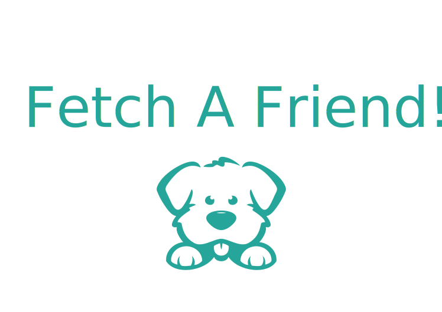
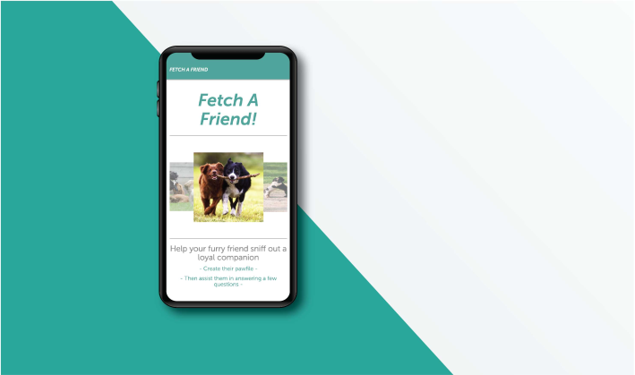

# Welcome to Fetch A Friend 

#### This is a full-stack web application, deployed through Heroku. Fetch A Friend provides our furry companions with the opportunity to connect with other pups that share similar interest. 
---

## Table of Contents
  * [Design Process](#design-process)
  * [Technologies](#technologies)
  * [Features And Functionality](#features-and-functionality)
  * [File Architecture](#file-architecture)
  * [Click here to visit the site!](https://intense-beyond-18003.herokuapp.com/)
---
<p align="center">
  
</p>

## Design Process
```

```
---
## Technologies
> <b>Design Tools:</b>
  * Adobe Illustrator
  * Adobe Photoshop
  
> <b>Development Tools:</b>
  * <b>Framework:</b> Materialize 
  * Express 
  * Path 
  * Node 
  * Heroku
---

## Features And Functionality
```

```
---

## File Architecture

<details><summary><b>Click To View</b></summary>
 
         ```
         fetch-a-friend
         ├── app
         │   ├── data
         │   │   └── friends.js
         │   ├── public 
         │   │   ├── home.html
         │   │   ├── survey.html
         │   │   ├── css 
         │   │   │   ├── materialize.css
         │   │   │   ├── materialize.min.css
         │   │   │   ├── reset.css
         │   │   │   └── style.css
         │   │   ├── images   
         │   │   │   ├── countess_droolsbury.jpg
         │   │   │   ├── miss_furbulous.jpg
         │   │   │   ├── professor_wagglesworth.jpg
         │   │   │   └── salvador_dogi.jpg 
         │   │   ├── materializejs
         │   │   │   ├── materialize.js
         │   │   │   └── materialize.min.js
         │   │   └── js
         │   │       └── layout.js
         │   └── routing
         │       ├── apiRoutes.js
         │       └── htmlRoutes.js
         ├── node_modules
         ├── readme_assets
         ├── .gitignore
         ├── package.json
         ├── README.md
         └── server.js
         ```


</details>

---

[Back To Top](#welcome-to-fetch-a-friend)

