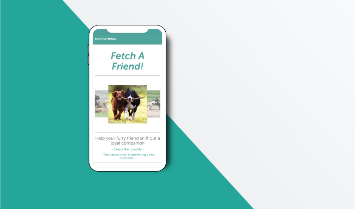

---
# Welcome to Fetch A Friend 

```
 This is a full-stack web application, deployed through Heroku. Fetch A Friend provides our furry companions with the opportunity to connect with other pups that share similar interest. 

```


*File Architecture*
```
    - app
      - data
        - friends.js
      - public 
        - home.html
        - survey.html
        - CSS
            - materialize.css
            - materialize.min.css
            - reset.css
            - style.css
        - images
            - countess_droolsbury.jpg
            - miss_furbulous.jpg
            - professor_wagglesworth.jpg
            - salvador_dogi.jpg
        - materializejs
            - materialize.js
            - materialize.min.js
        - js
            - layout.js
      - routing
        - apiRoutes.js
        - htmlRoutes.js
    - node_modules
    - readme_assets
    - .gitignore
    - package.json
    - README.md
    - server.js
```


